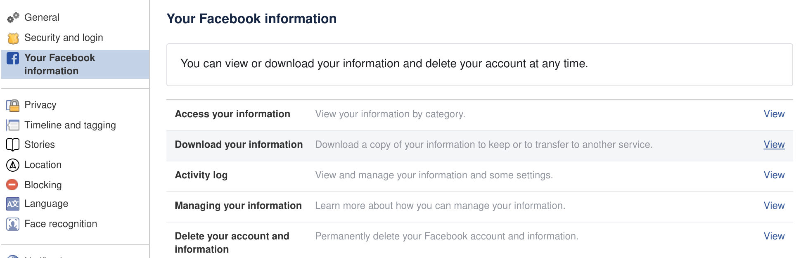
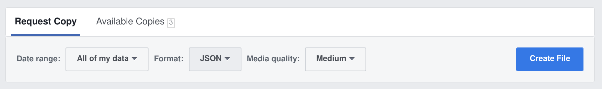
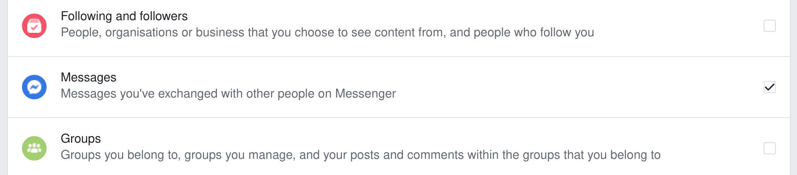

# chatcount
Count messages and characters sent between you and your friends through Facebook Messenger. This tool analysises a facebook JSON data collection file and shows a summary of all messages sent and recieved.

## Usage
Start of by producing a Facebook compilation JSON file from Facebook. While signed in to your Facebook account, do the following:

1. Go to `Settings -> Your Facebook information -> Download your information`.

2. Select settings *All of my data*, *JSON* and *Medium*.

3. Make sure that *Messages* are selected in the list *Your information*.

