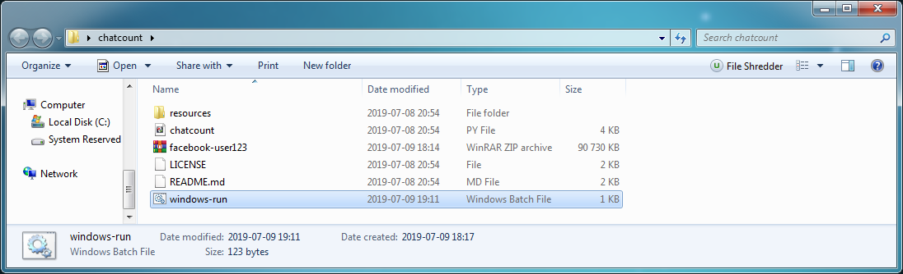

# chatcount
Count messages and characters sent between you and your friends through Facebook Messenger. This tool analysises a facebook JSON data collection file and shows a summary of all messages sent and recieved.

## Example output

## Usage
Start of by producing a Facebook compilation JSON file from Facebook. While signed in to your Facebook account, do the following:

1. Go to `Settings -> Your Facebook information -> Download your information`.

2. Select settings: *Date range: __All of my data__*; *Format: __JSON__*; *Media quality: __Medium__*.

3. Make sure that *Messages* are selected in the list *Your information*. All other fields are optional (and will not impact the usage or result).

4. Click __Create file__ and wait for Facebook to create the compilation file. Once the file is completed you will get a notification through Facebook. Download the generated zipfile and place it in the repository root directory.

__For UNIX-based/Linux systems:__ Invoke the python-script *chatcount.py* with the generated zipfile as commandline argument, example: `./chatcount.py facebook-examplename123.zip`. If you are unable to run the script you might have to mark it as executable by invoking `chmod +x chatcount.py`. The result is printed through standard out.

__For Windows-based systems:__ Start of by making sure that you have a copy of [Python 3](https://www.python.org/downloads/release) installed __and__ make sure that Python is added to your PATH ([see this guide](https://geek-university.com/python/add-python-to-the-windows-path/) on how to add Python to your PATH). With Python installed, add the Facebook compilation file to the script directory and run *windows-run.bat*. Only one Facebook compilation file can be present in the directory when runing this script.

